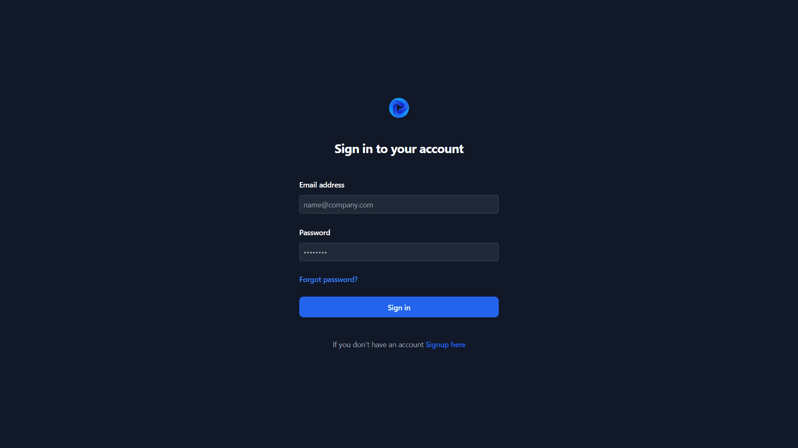
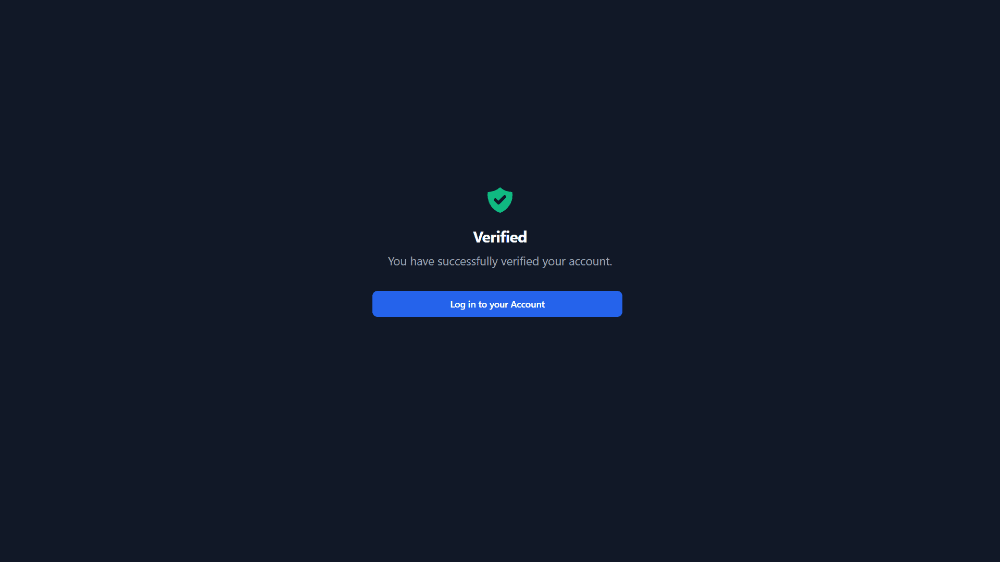
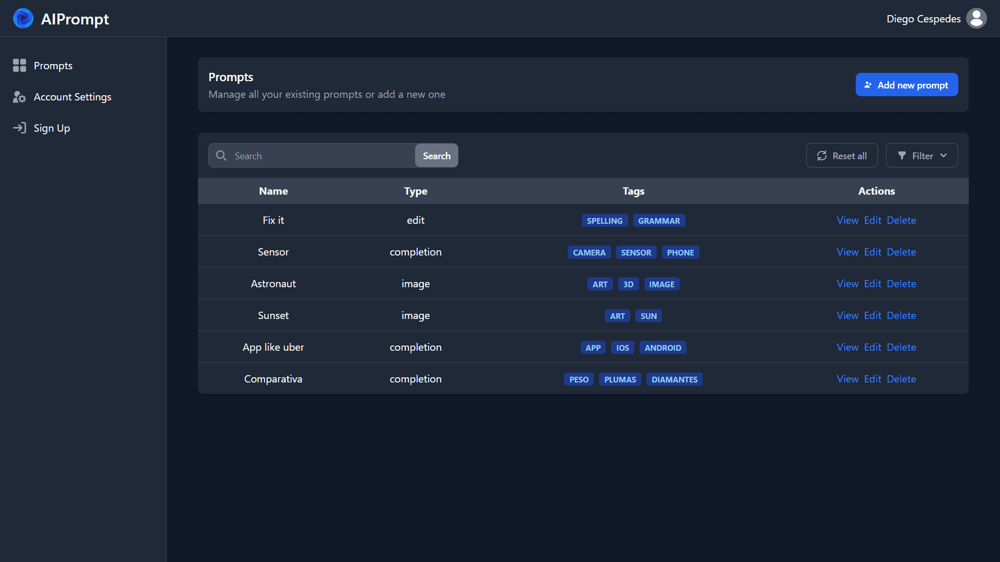
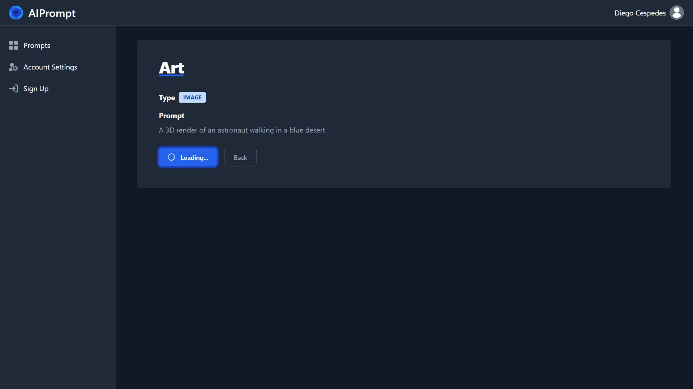
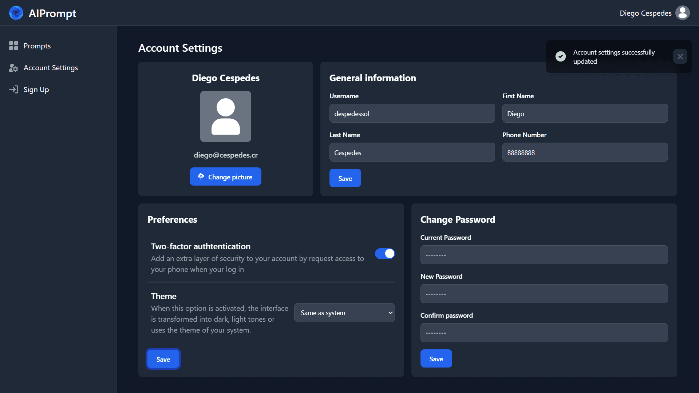
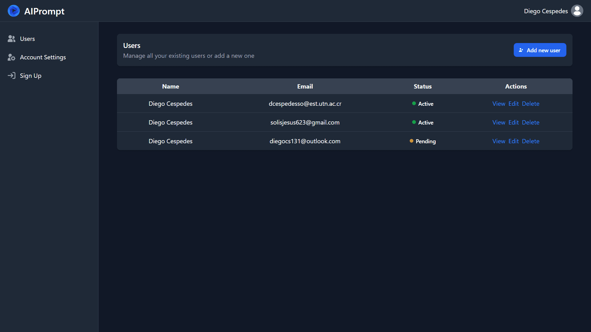

# AI Prompts

AI Prompts is a web application that generates creative prompts using artificial intelligence.

Por supuesto, aquí tienes un índice enlazado a los títulos con formato Markdown:

## Index

- [AI Prompts](#ai-prompts)
  - [Index](#index)
  - [Getting Started](#getting-started)
    - [Step 1: Clone the Repository](#step-1-clone-the-repository)
    - [Step 2: Install Dependencies](#step-2-install-dependencies)
    - [Step 3: Create .env File](#step-3-create-env-file)
    - [Step 4: Start the Development Server](#step-4-start-the-development-server)
  - [Features](#features)
  - [Technologies Used](#technologies-used)
  - [Screenshots](#screenshots)
    - [Login](#login)
    - [Verify account](#verify-account)
    - [2FA](#2fa)
    - [Prompts](#prompts)
    - [Run Image Prompt](#run-image-prompt)
    - [Account Settings](#account-settings)
    - [Admin dashboard](#admin-dashboard)

## Getting Started

To run AI Prompts locally, follow these steps:

### Step 1: Clone the Repository

Clone the AI Prompts frontend repository from GitHub using the following command:

```bash
git clone https://github.com/diegox196/AI-Prompts-Frontend.git
```

### Step 2: Install Dependencies

Navigate to the project folder and install the required dependencies using npm or yarn:

```bash
cd AI-Prompts-Frontend
npm install
# or
yarn install
```

### Step 3: Create .env File

Create a `.env` file in the root of the project directory to store environment variables. This file should contain the necessary configuration settings. For example:

```plaintext
REACT_APP_API_URI=http://your-api-url
REACT_APP_GRAPHQL_URI=http://your-graphq-url
```

### Step 4: Start the Development Server

Once you have set up the `.env` file, you can start the development server to run the application locally:

```bash
npm start
# or
yarn start
```

This will launch the AI Prompts application in your default web browser in `http://localhost:3000`. Any changes you make to the code will automatically trigger a hot reload, so you can see the updates in real-time.

## Features

- **Prompts Management:** You can view and manage your prompts, including creating, updating, running and deleting them through the dashboard.

- **Users Management:** Administrators can and manage user accounts, including creating, updating, and deleting user profiles.

- **User Authentication:** Users can sign up, log in, and manage their accounts, ensuring a personalized experience.

- **Change Password:** Securely change your account password through the Change Password section.

- **General Information:** Edit and update your account's general information, such as username, first name, last name, and phone number.

- **Preferences:** Customize your experience with AI prompts by enabling or disabling two-factor authentication and selecting your preferred theme (dark, light or system default).


## Technologies Used

- **React:** A JavaScript library for building user interfaces.

- **Axios:** A promise-based HTTP client for making API requests.
 
- **Tailwind CSS:** A utility-first CSS framework for styling components.
 
- **React Router:** For handling routing and navigation in the application.


## Screenshots

### Login


### Verify account


### 2FA


### Prompts


### Run Image Prompt


### Account Settings


### Admin dashboard 


